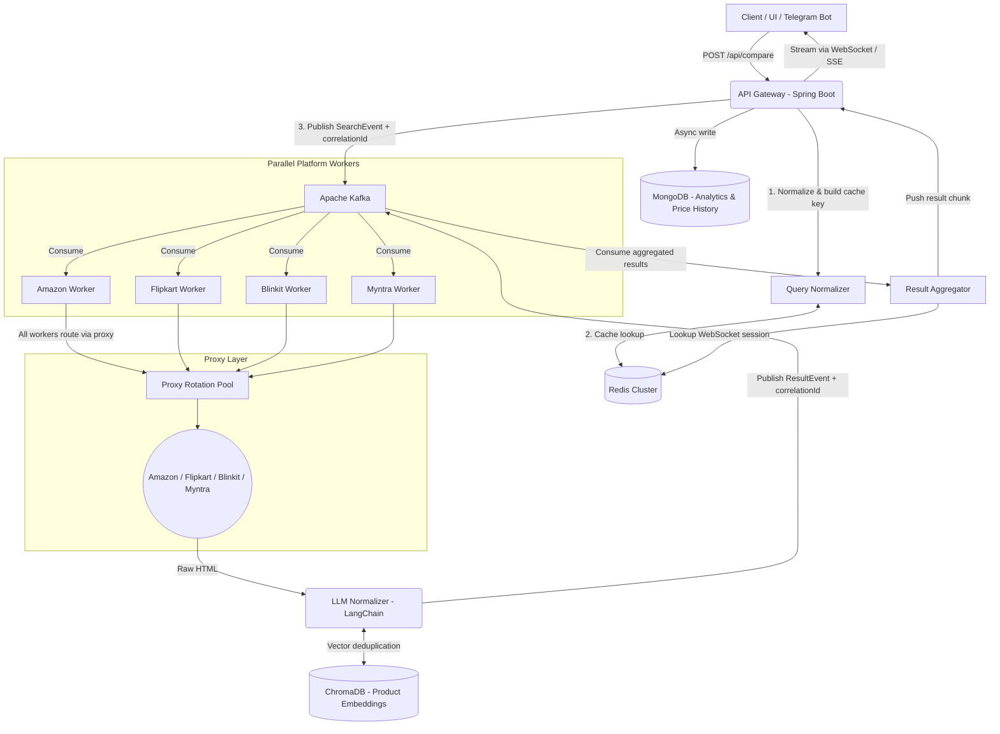
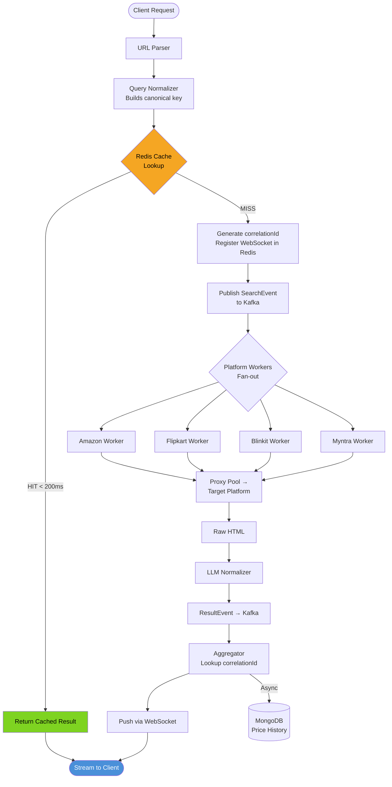
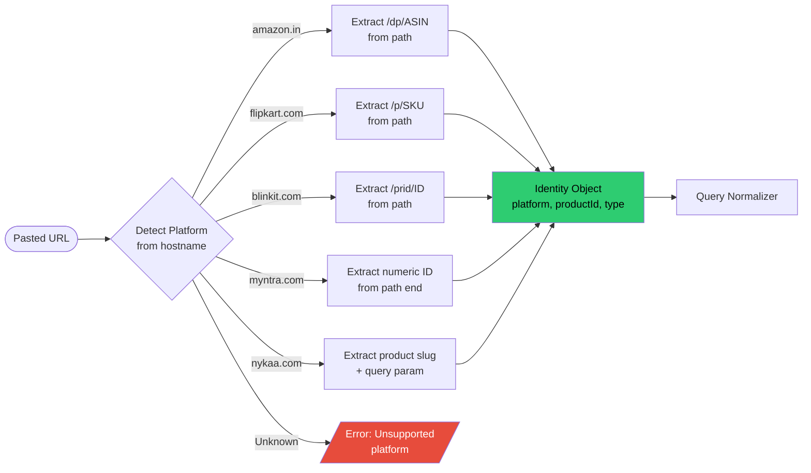
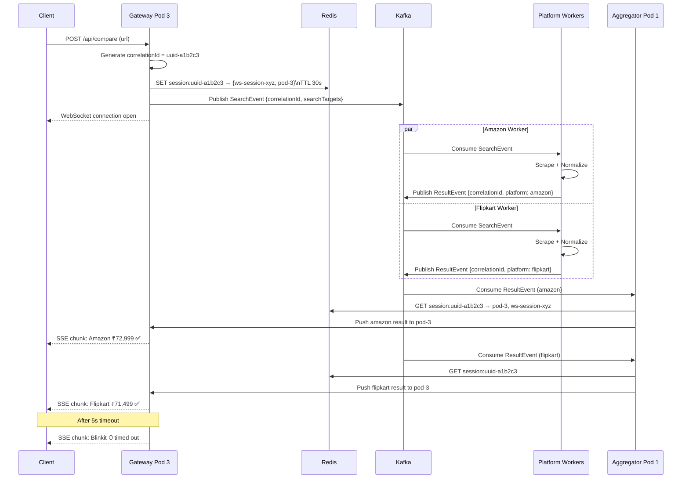
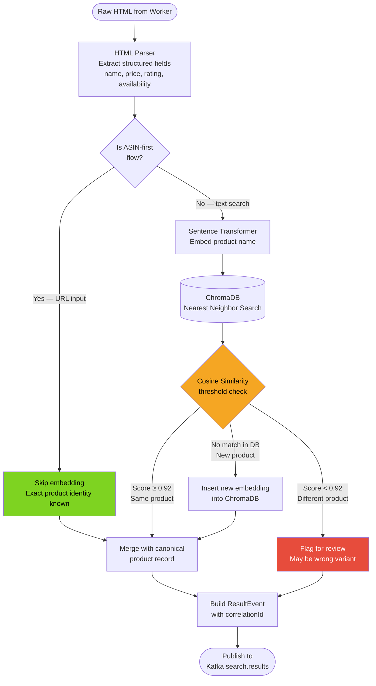
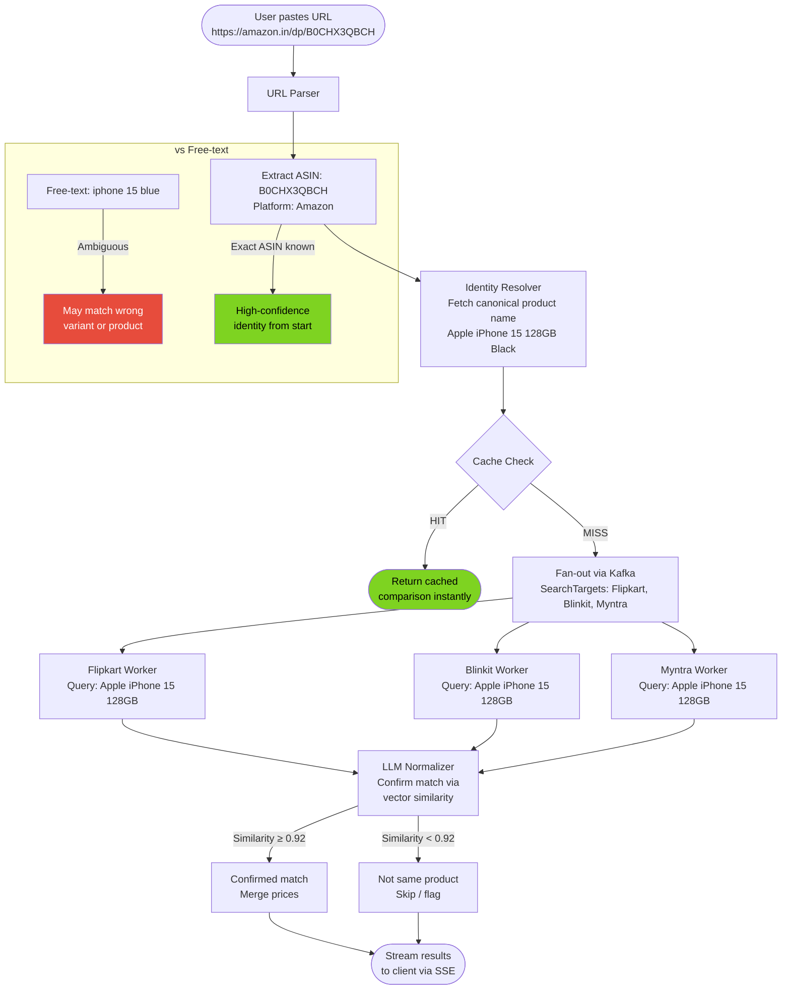
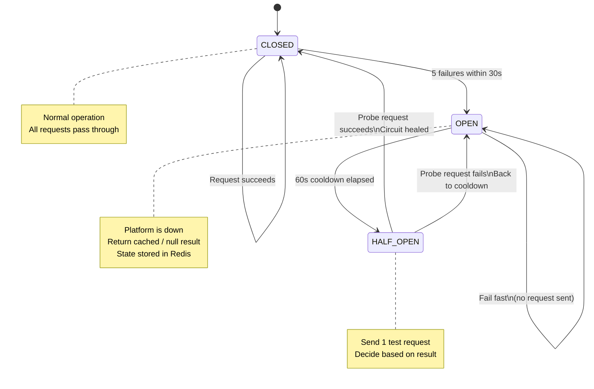
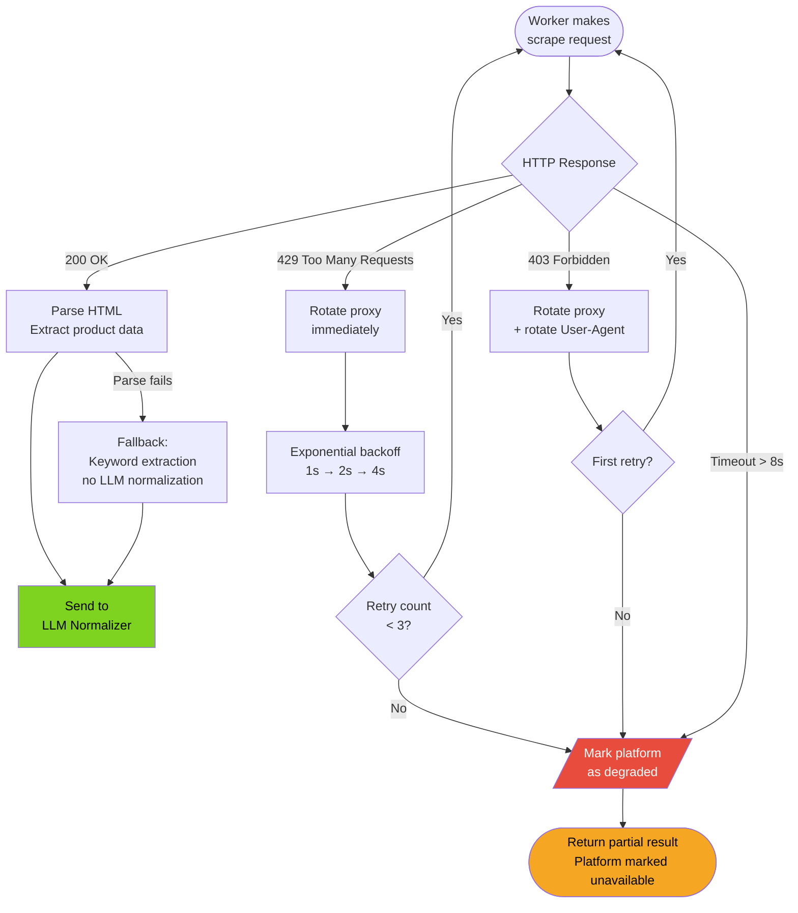
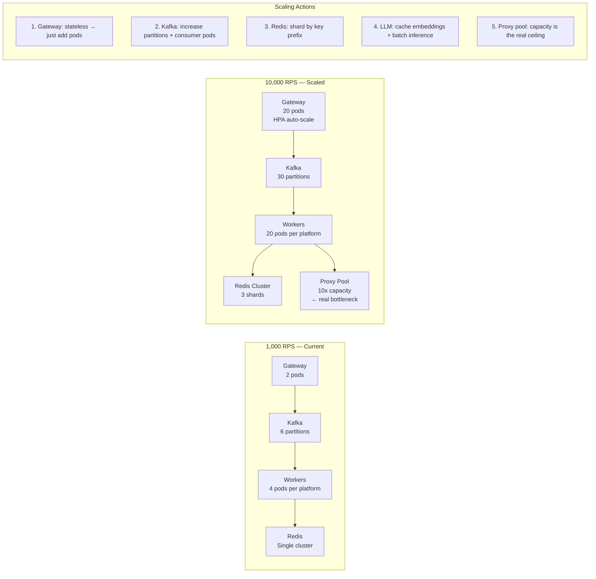

# System Design Document: OmniCart
### Real-Time E-Commerce Arbitrage Engine

**Version:** 1.2 | **Author:** Himanshu Gupta | **Target Level:** SDE 2  
**Last Updated:** March 2026

---

## Table of Contents

1. [Product Vision](#1-product-vision)
2. [Non-Functional Requirements](#2-non-functional-requirements)
3. [High-Level Architecture](#3-high-level-architecture)
   - 3.1 System Architecture Diagram
   - 3.2 Request Lifecycle
   - 3.3 Cache Hit vs Miss Flow *(diagram)*
4. [Component Deep Dive](#4-component-deep-dive)
   - 4.1 URL Parser *(diagram)*
   - 4.2 Query Normalizer & Cache Key Design
   - 4.3 Correlation ID & WebSocket Session Management *(sequence diagram)*
   - 4.4 LLM Normalizer *(diagram)*
   - 4.5 Proxy Rotation Pool
   - 4.6 MongoDB — Analytics & Price History
5. [URL-First Flow](#5-url-first-flow-core-feature) *(diagram)*
6. [Data Models](#6-data-models)
7. [Failure Handling & Resilience](#7-failure-handling--resilience)
   - 7.1 Partial Result Strategy *(timeline diagram)*
   - 7.2 Circuit Breaker *(state machine diagram)*
   - 7.3 Scrape Failure Recovery *(diagram)*
8. [Scaling Strategy](#8-scaling-strategy)
   - 8.2 1,000 → 10,000 RPS *(diagram)*
9. [Open Questions & Trade-offs](#9-open-questions--trade-offs)

---

## 1. Product Vision

OmniCart is a distributed, event-driven arbitrage engine — essentially **Skyscanner for Indian e-commerce**. A user pastes any product URL from Amazon, Flipkart, Blinkit, Myntra, or Nykaa, and OmniCart returns a real-time price comparison across all supported platforms in a single view.

**Core value propositions:**
- URL-first input: no need to type queries, just paste any product link
- Results stream in progressively (Skyscanner-style UX), no waiting for all platforms
- LLM-powered product normalization handles naming inconsistencies across platforms
- Price history tracking: "this iPhone was ₹2,000 cheaper last week on Flipkart"

---

## 2. Non-Functional Requirements

| Requirement | Target |
|---|---|
| Availability | 99.9% uptime for API Gateway |
| Cache Hit Latency | < 200ms P99 |
| Live Scrape Latency | < 5 seconds P99 |
| Throughput | 1,000 concurrent search requests (burst) |
| Consistency | Eventual — Redis used for real-time state aggregation |
| Partial Results | Return available results after 5s; mark timed-out platforms clearly |

---

## 3. High-Level Architecture

The system uses a **fan-out architecture via Kafka**. A single search event is broadcast to multiple platform-specific workers for parallel execution, without blocking the main API thread. Results stream back to the client over WebSocket/SSE as each worker completes.

### 3.1 System Architecture Diagram



### 3.2 Request Lifecycle (Step by Step)

```
1.  User pastes URL  →  POST /api/compare { url: "https://amazon.in/dp/B0CHX3QBCH" }
2.  URL Parser extracts platform + product ID (ASIN, SKU, etc.)
3.  Query Normalizer builds a canonical cache key
4.  Redis cache check → HIT: return cached result immediately
5.  MISS: Generate correlationId + register WebSocket session in Redis
6.  Publish SearchEvent to Kafka topic: search.requests
7.  Platform Workers consume event in parallel
8.  Each Worker → Proxy Pool → Target Platform → Raw HTML
9.  Raw HTML → LLM Normalizer → structured ProductResult
10. Normalizer embeds product name → ChromaDB dedup check
11. Publish ResultEvent to Kafka topic: search.results
12. Aggregator consumes ResultEvent → looks up correlationId → pushes to correct WebSocket
13. Client receives results as they arrive (stream, not wait)
14. After 5s timeout: return partial results, mark missing platforms
15. Final result written async to MongoDB (price history, analytics)
```

### 3.3 Cache Hit vs Miss Flow



---

## 4. Component Deep Dive

### 4.1 URL Parser & Product ID Extractor

This is the first layer — and the most important for accuracy. Knowing the platform and product ID before searching eliminates ambiguity.

```
Input:  https://www.amazon.in/Apple-iPhone-15/dp/B0CHX3QBCH/ref=...
Output: { platform: "amazon", productId: "B0CHX3QBCH", type: "ASIN" }

Input:  https://www.flipkart.com/apple-iphone-15/p/itm123abc
Output: { platform: "flipkart", productId: "itm123abc", type: "SKU" }

Input:  https://blinkit.com/prn/iphone-15/prid/123456
Output: { platform: "blinkit", productId: "123456", type: "ProductId" }
```

Supported platforms: Amazon.in, Flipkart, Blinkit, Myntra, Nykaa



### 4.2 Query Normalizer & Cache Key Design

Cache key must be deterministic — two users searching for the same product must hit the same key.

```
Raw URL / Query → lowercase + extract identifiers → canonical key

"iPhone 15 128GB Blue"  →  "iphone:15:128gb:blue"
"ASIN: B0CHX3QBCH"     →  "asin:b0chx3qbch"           ← preferred (exact)
"SKU: itm123abc"        →  "sku:itm123abc"
```

**TTL Strategy by platform** (prices change at different cadences):

| Platform | TTL |
|---|---|
| Blinkit | 30 minutes |
| Amazon | 2 hours |
| Flipkart | 2 hours |
| Myntra / Nykaa | 6 hours |

### 4.3 Correlation ID & WebSocket Session Management

This is the mechanism that ties a distributed fan-out back to a single client connection. Without it, the Gateway cannot know which WebSocket to push results to.

```json
// SearchEvent published to Kafka
{
  "correlationId": "uuid-a1b2c3",
  "sessionId":     "ws-session-xyz",
  "productId":     "B0CHX3QBCH",
  "platform":      "amazon",
  "searchTargets": ["flipkart", "blinkit", "myntra"],
  "timestamp":     1711584000
}
```

The Gateway stores a mapping in Redis:
```
Key:   "session:uuid-a1b2c3"
Value: { webSocketSession: "ws-session-xyz", pod: "gateway-pod-3", timeout: 5000 }
TTL:   30 seconds
```

Any pod in the cluster can look up which WebSocket session to push results to, enabling **horizontal scaling of the Gateway**.



### 4.4 LLM Normalizer

Handles the hardest problem: "Apple iPhone 15 128GB Midnight" on Amazon vs "iPhone15 BLK 128" on Blinkit — same product, different naming.

**Flow:**
```
Raw HTML  →  extract { name, price, rating, availability, image_url }
          →  embed product name with sentence-transformers
          →  ChromaDB nearest-neighbor search
          →  if similarity > 0.92 → same product → merge results
          →  if similarity < 0.92 → different product → flag for review
          →  publish structured ResultEvent to Kafka
```



**ResultEvent schema:**
```json
{
  "correlationId": "uuid-a1b2c3",
  "platform":      "flipkart",
  "productName":   "Apple iPhone 15 (128GB, Black)",
  "price":         72999,
  "currency":      "INR",
  "availability":  "in_stock",
  "url":           "https://flipkart.com/...",
  "imageUrl":      "https://...",
  "rating":        4.5,
  "scrapedAt":     1711584042
}
```

### 4.5 Proxy Rotation Pool

**Critical fix from v1.1:** All platform workers must route through the proxy pool — not just Amazon. Flipkart and Blinkit have equally aggressive bot detection.

- Rotating residential proxies (e.g., Bright Data / Oxylabs)
- Per-platform rate limiting to avoid detection patterns
- Automatic proxy health checks and rotation on 403/429 responses
- User-agent rotation + request header normalization

> **Legal Note:** Flipkart, Amazon, and Blinkit ToS prohibit scraping. For production, explore Amazon PA-API (affiliate), Flipkart Seller API, and official data partnerships. For portfolio/interview purposes, the scraping approach demonstrates the architecture correctly.

### 4.6 MongoDB — Analytics & Price History

Used for async writes only — not in the critical path.

**Collections:**

```js
// price_history
{
  productId:   "B0CHX3QBCH",
  platform:    "amazon",
  price:       72999,
  currency:    "INR",
  recordedAt:  ISODate("2026-03-28T10:00:00Z")
}

// search_events
{
  correlationId: "uuid-a1b2c3",
  query:         "iphone 15 128gb",
  userId:        "user-789",          // optional
  platforms:     ["amazon", "flipkart", "blinkit"],
  resultCount:   3,
  latencyMs:     3420,
  createdAt:     ISODate("2026-03-28T10:00:00Z")
}
```

This enables the **price history feature**: "Amazon dropped ₹2,000 last Tuesday."

---

## 5. URL-First Flow (Core Feature)

This is the differentiating input mode. Pasting a URL gives the system a known product identity before any searching begins, dramatically improving match accuracy vs free-text.



**Contrast with free-text search:** A query like "iphone 15 blue" is ambiguous. A URL gives us the exact ASIN, so we can extract the canonical product name and search other platforms with high specificity.

---

## 6. Data Models

### 6.1 Redis Keys Reference

| Key Pattern | Value | TTL |
|---|---|---|
| `cache:asin:{id}` | Serialized comparison result | Per-platform TTL |
| `cache:query:{canonical}` | Serialized comparison result | 2 hours |
| `session:{correlationId}` | WebSocket session metadata | 30 seconds |
| `circuit:{platform}` | OPEN / HALF_OPEN / CLOSED | Dynamic |

### 6.2 Kafka Topics

| Topic | Producer | Consumer | Purpose |
|---|---|---|---|
| `search.requests` | API Gateway | Platform Workers | Fan-out search jobs |
| `search.results` | LLM Normalizer | Result Aggregator | Collect worker results |
| `price.alerts` | Aggregator | Notification Service | Price drop alerts (future) |

---

## 7. Failure Handling & Resilience

### 7.1 Partial Result Strategy

A 5-second hard timeout applies per search request. Results from completed workers are returned immediately; timed-out platforms are marked explicitly.

```mermaid
gantt
    title Search Request Timeline (ms)
    dateFormat X
    axisFormat %Lms

    section Gateway
    Receive request & cache miss    : 0, 80
    Publish to Kafka                : 80, 120
    Wait for results / timeout      : 120, 5000

    section Amazon Worker
    Consume + Proxy + Scrape        : 200, 1800
    LLM Normalize                   : 1800, 2200
    Publish ResultEvent             : 2200, 2250

    section Flipkart Worker
    Consume + Proxy + Scrape        : 200, 2800
    LLM Normalize                   : 2800, 3200
    Publish ResultEvent             : 3200, 3250

    section Blinkit Worker
    Consume + Proxy + Scrape        : 200, 5000
    TIMEOUT — marked as unavailable : crit, 5000, 5100

    section Client SSE Stream
    Amazon result received          : milestone, 2250, 2250
    Flipkart result received        : milestone, 3250, 3250
    Timeout — partial response sent : crit, milestone, 5000, 5000
```



```json
// Example partial response after timeout
{
  "correlationId": "uuid-a1b2c3",
  "status": "partial",
  "results": [
    { "platform": "amazon",   "price": 72999, "status": "success" },
    { "platform": "flipkart", "price": 71499, "status": "success" },
    { "platform": "blinkit",  "price": null,  "status": "timeout" }
  ],
  "message": "Blinkit result unavailable. Try refreshing for live price."
}
```

### 7.2 Circuit Breaker (per Platform Worker)

Using **Resilience4j** circuit breaker pattern, with state shared in Redis across all pods.



Circuit state stored in Redis so all pods share the same view. Thresholds:
- Open after 5 consecutive failures within 30 seconds
- Half-open probe after 60 seconds

### 7.3 Scrape Failure Recovery



---

## 8. Scaling Strategy

### 8.1 Horizontal Scaling Points

| Component | Scaling Mechanism |
|---|---|
| API Gateway | Stateless pods behind load balancer; session state in Redis |
| Kafka Consumers | Consumer groups — add pods to scale worker throughput |
| LLM Normalizer | Horizontal pod autoscaling; GPU-backed if using local model |
| Redis | Redis Cluster (sharding by key prefix) |
| MongoDB | Replica sets + read replicas for analytics queries |

### 8.2 From 1,000 → 10,000 Concurrent Requests



1. **Gateway:** Already stateless — scale horizontally via Kubernetes HPA
2. **Kafka partitions:** Increase from 6 → 30 partitions per topic; add worker pods per consumer group
3. **Redis:** Move to Redis Cluster with 3+ shards
4. **LLM Normalizer bottleneck:** Cache embeddings by product name; batch inference calls
5. **Proxy Pool:** Increase proxy pool size proportionally (proxy throughput is likely the real bottleneck)

### 8.3 Cache Warming Strategy

For popular products (detected via search frequency in MongoDB), pre-warm Redis cache on a scheduled job every 30 minutes. This ensures the most commonly searched products always return sub-200ms responses.

---

## 9. Open Questions & Trade-offs

### Trade-off: Kafka vs Simple Message Queue (SQS/RabbitMQ)

| | Kafka | SQS |
|---|---|---|
| Replay | ✅ Yes — debug scrape failures | ❌ No |
| Consumer groups | ✅ Isolated per platform | ⚠️ Limited |
| Backpressure | ✅ Natural via partition lag | ❌ Requires separate logic |
| Operational overhead | ❌ Higher | ✅ Managed service |

**Decision:** Kafka chosen for replay (debugging bad scrapes) and consumer group isolation. Acceptable complexity trade-off for this use case.

### Trade-off: LLM Normalization vs Rule-Based

- LLM handles brand variations, regional naming, abbreviations automatically
- Latency cost: ~500ms per normalization call (can be cached by product name hash)
- Rule-based fallback for common patterns (ASIN → always exact match)

### Open Questions

1. **How do we handle product variants?** (iPhone 15 128GB vs 256GB — same listing, different SKU)
2. **What's the dedup threshold?** 0.92 cosine similarity is a guess — needs A/B testing against real data
3. **Myntra/Nykaa scraping?** These are fashion/beauty — catalog is less structured than electronics
4. **Authentication-gated prices?** Some platforms show different prices to logged-in users

---

## Interview Prep — Anticipated Questions

**"How do you handle a platform going down?"**  
Circuit breaker per worker (Resilience4j). After 5 failures in 30s, the circuit opens — subsequent requests for that platform fail fast and return a null result with a "platform unavailable" message. Gateway still returns results from healthy platforms.

**"How do you scale to 10,000 concurrent searches?"**  
Kafka consumer group scaling (add pods), stateless Gateway behind HPA, Redis Cluster for shared state. The proxy pool capacity is likely the real bottleneck before anything in our stack.

**"What's your cache invalidation strategy?"**  
TTL-based per platform (Blinkit: 30min, Amazon: 2hr). No active invalidation — eventual consistency is acceptable for price comparison. If we add price-drop webhooks from affiliate APIs in the future, those can trigger targeted cache eviction.

**"Why not just use the Amazon PA-API?"**  
PA-API is available but requires affiliate status, has rate limits, and doesn't cover Flipkart/Blinkit. Scraping is the only way to cover all platforms uniformly. Long-term, official APIs are preferred per-platform where available.

**"How does the LLM normalizer know two products are the same?"**  
Sentence-transformer embeddings of the product name, stored in ChromaDB. Cosine similarity > 0.92 = same product. The ASIN-first flow (URL input) bypasses this entirely — we already know the product identity.

---

*Document maintained by Himanshu Gupta. For questions, open a discussion in the project repo.*
